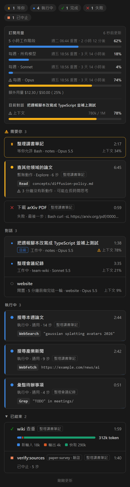
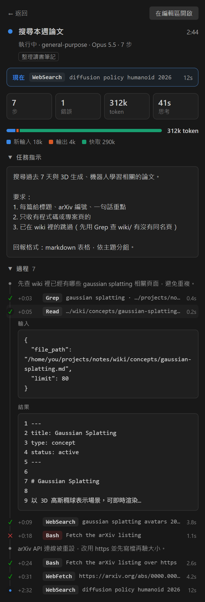
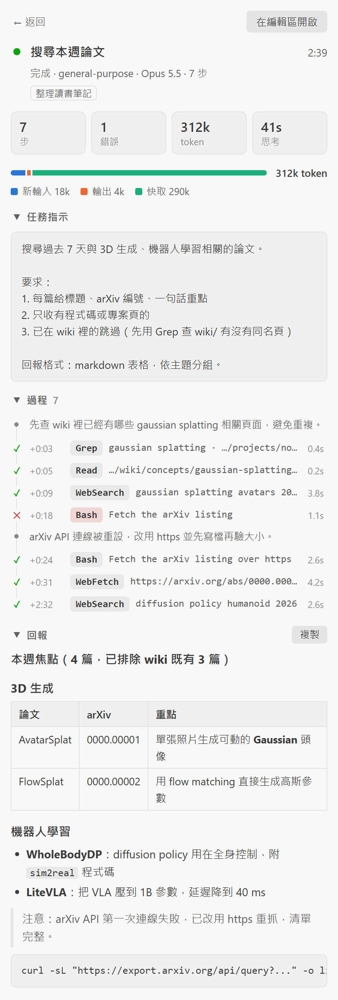
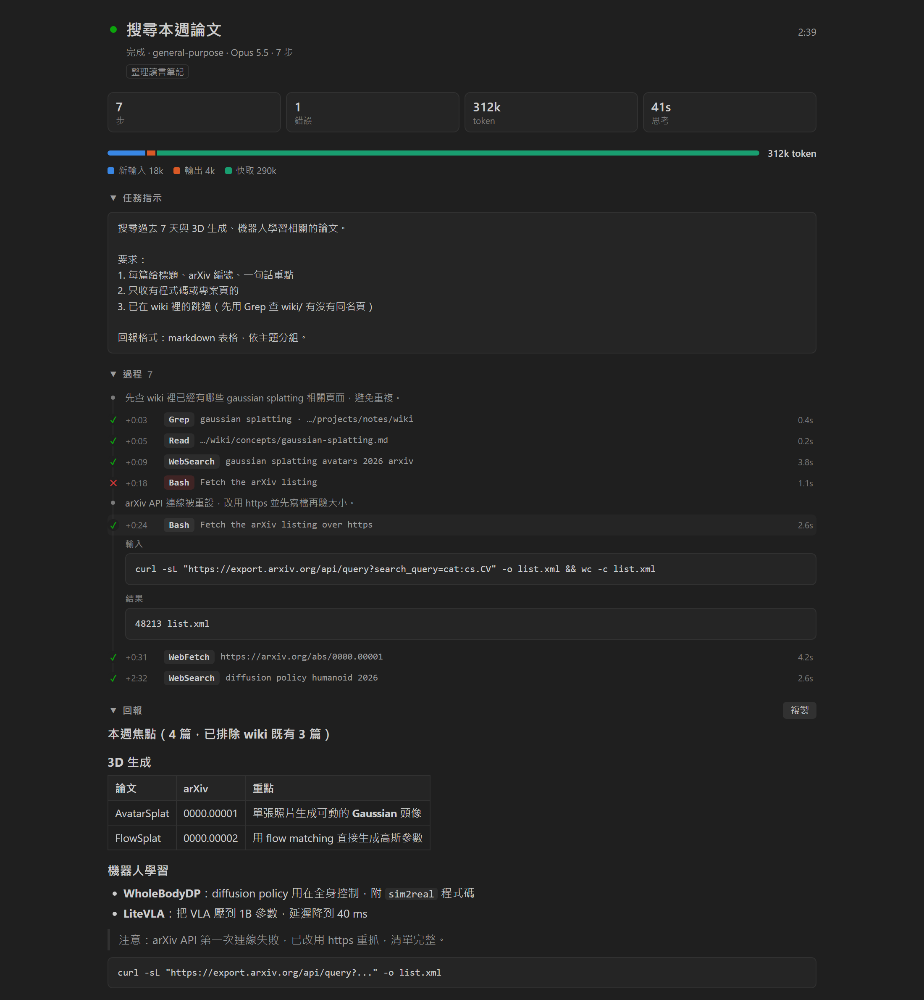
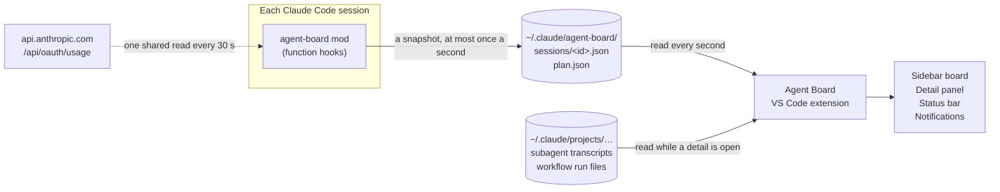

<h1 align="center">Agent Board for Claude Code</h1>

<p align="center">
  <b>See what every Claude Code subagent is doing, right inside VS Code.</b><br>
  Live subagent cards, full task details, subscription usage and context fill, across all your open conversations.
</p>

<p align="center">
  
  
  
  
  
</p>

<p align="center"><b>English</b> · <a href="README.zh-TW.md">繁體中文</a></p>

<table>
  <tr>
    <td width="33%" valign="top"></td>
    <td width="33%" valign="top"></td>
    <td width="33%" valign="top"></td>
  </tr>
  <tr>
    <td valign="top"><sub><b>The board.</b> Usage, the conversations waiting for you, every running subagent.</sub></td>
    <td valign="top"><sub><b>A subagent mid-run.</b> What it does this second, the task it was given, each step with its input and result.</sub></td>
    <td valign="top"><sub><b>The same subagent, ended.</b> Its report, rendered. (Light theme.)</sub></td>
  </tr>
</table>

<sub>All screenshots use made-up data.</sub>

## Why this exists

Claude Code can run several subagents at once, and several conversations at once. In VS Code it is hard to see what each of them is doing.

Claude Code mods (plugins made of function hooks) can draw panes and bars, but **VS Code's Claude Code extension does not draw them** (checked up to 2.1.289). Its webview takes no mod interface, so a mod's pane or its bar above the prompt never shows there. They show in the terminal and in the desktop app only.

Agent Board gets around this by splitting the job in two:

| Half | What it is | What it does |
|---|---|---|
| **The mod** | A Claude Code plugin, loaded into every session | Watches the session and writes small JSON files to `~/.claude/agent-board/` |
| **The extension** | A VS Code extension with its own sidebar view | Reads those files once a second and draws the board |

## What you get

**A live board of subagents.** One card per running subagent: its state, type, step count, the tool call it is on, and the time it has run. Ended subagents keep a row with their token breakdown. A subagent with no tool call for two minutes is flagged as quiet, and one whose session stopped reporting as possibly lost.

**Task details, like the built-in agent card.** Click a card or row to open that subagent's detail:

- the task it was given, in full
- every tool call on a timeline, with its input, its result, how long it took, and ✓ or ✕
- what it said between steps
- its final report, rendered as Markdown (tables, lists, code)
- tokens, counted once per request

**在編輯區開啟** opens the same detail wide in an editor tab. A workflow's agents show their real labels and phases.

<p align="center"></p>

**A "needs you" section.** Conversations waiting for a permission or an answer, subagents gone quiet, and recent failures are grouped at the top. The status bar turns to "在等你" while a conversation waits.

**Subscription usage that keeps up.** The 5-hour and weekly windows of your Claude plan, with per-model buckets and extra usage when you have them. Resets are worded as claude.ai's usage page words them. The status bar always shows `5h % · 週 %`.

**The right conversation's context.** Each conversation's context fill, computed the way `/context` computes it. The meter follows the Claude tab you are looking at, and the status bar shows it too.

**Notifications** when a conversation has waited 15 seconds, a subagent ends or fails, a long turn finishes, or usage crosses 80% or 90%. Each kind has its own switch.

## How it works



- **Snapshots.** The mod hooks session, turn, tool-call and agent events. It writes `sessions/<sessionId>.json` whenever something changed, at most once a second, and once a minute as a heartbeat. The file holds the subagent rows, the session's activity (working, waiting, idle), its context fill and its rate-limit readings.
- **Usage, from two sources.** Every API reply carries rate-limit readings, which are fresh but run slightly behind. The usage endpoint that `/usage` reads is exact, so **one** session reads it for all of them every 30 seconds, through `plan.json`. Use within a window only grows, so the board shows the **highest** reading of the window in force. After a reset or a change of account, the earlier window's readings fall away at once.
- **Task details.** Claude Code already writes each subagent's transcript next to its session's. The extension reads that file while a detail is open, and again whenever it grows. It also reads workflow run files for agent labels and phases.
- **Which conversation is "current".** VS Code does not tell one extension which Claude conversation another extension's tab shows. The board matches the focused tab's title against the title Claude Code writes into each transcript.

## Requirements

- **Claude Code 2.1.289 or later**, with mods (function-hook plugins) available to your account. This is the build it was developed against.
- **VS Code 1.90 or later** with the Claude Code extension.
- **A Claude subscription** for the usage meters. A session on an API key shows no usage windows; everything else works.
- **git**, and the `code` command on your PATH.

Developed and tested on Windows 11. The paths are resolved for macOS and Linux as well, but those are untested.

## Install

### Let Claude Code do it

Paste this into Claude Code on the machine you want it on:

```text
Install Agent Board from https://github.com/JeremyHo1123/claude-code-agent-board.
Follow the "Install" section of its README step by step, then run every check
under "Verify" and tell me the result of each one.
```

### Or do it by hand

**1. Clone the repository into Claude Code's mods folder.**

```bash
# macOS, Linux, Git Bash
git clone https://github.com/JeremyHo1123/claude-code-agent-board.git ~/.claude/mods/agent-board
```

```powershell
# Windows PowerShell
git clone https://github.com/JeremyHo1123/claude-code-agent-board.git "$env:USERPROFILE\.claude\mods\agent-board"
```

**2. Tell Claude Code to load the mod.** Add `CLAUDE_CODE_PLUGIN_DIRS` to the `env` block of `~/.claude/settings.json`. Keep every other key in the file as it is.

```json
{
  "env": {
    "CLAUDE_CODE_PLUGIN_DIRS": "~/.claude/mods/agent-board"
  }
}
```

If `CLAUDE_CODE_PLUGIN_DIRS` already has a value, append this folder to it. Separate the paths with `;` on Windows and `:` elsewhere.

**3. Install the VS Code extension.** A built package ships in `dist/`, so nothing needs compiling.

```bash
# macOS, Linux, Git Bash
code --install-extension ~/.claude/mods/agent-board/dist/agent-board.vsix --force
```

```powershell
# Windows PowerShell
code --install-extension "$env:USERPROFILE\.claude\mods\agent-board\dist\agent-board.vsix" --force
```

**4. Reload.** In VS Code, run **Developer: Reload Window** from the Command Palette. This restarts the Claude Code sessions in that window, so do it while none of them is mid-task. Each session loads the mod as it starts.

### Verify

| Check | Expected |
|---|---|
| `claude plugin validate ~/.claude/mods/agent-board` | ends with `Validation passed` |
| Type `/agent-board` in a Claude Code conversation | it answers with the subagent board |
| List `~/.claude/agent-board/sessions/` | one `<sessionId>.json` per open conversation, modified within the last minute |
| `code --list-extensions --show-versions` | lists `jeremy-local.agent-board@0.5.1` |
| Look at VS Code | an **Agent Board** icon in the activity bar; `5h …% · 週 …%` and `上下文 …%` in the status bar once a conversation has had one reply |

### Update

```bash
git -C ~/.claude/mods/agent-board pull
code --install-extension ~/.claude/mods/agent-board/dist/agent-board.vsix --force
```

Then reload the window. A change to the mod alone needs no window reload: interactive sessions watch the folder and reload the mod themselves, and `/reload-plugins` forces it.

### Uninstall

```bash
code --uninstall-extension jeremy-local.agent-board
```

Remove the folder from `CLAUDE_CODE_PLUGIN_DIRS`, then delete `~/.claude/mods/agent-board` and `~/.claude/agent-board`.

## Reading the board

The interface is in Traditional Chinese. These are the labels you will meet:

| On screen | Meaning |
|---|---|
| 訂閱用量 | Subscription usage: the 5-hour window (5 小時工作階段) and the weekly windows (每週) |
| 目前對話 · 上下文 | The current conversation and its context fill |
| 需要你 | Needs you: conversations waiting, subagents gone quiet, recent failures |
| 對話 | Conversations, listed when more than one is open; 目前 marks the one the context meter shows |
| 執行中 / 已結束 | Running / ended subagents |
| 等你 · 完成 · 失敗 · 已中止 | Waiting for you · done · failed · stopped |
| 任務指示 · 過程 · 回報 | In a detail: the task it was given · its steps · its report |
| 在編輯區開啟 · 返回 · 複製 | Open in an editor tab · back · copy the report |

## Settings

All of them live under `agentBoard.*` in VS Code's settings.

| Setting | Default | What it does |
|---|---|---|
| `agentBoard.autoReveal` | `true` | Shows the board when two or more subagents run at once, without taking the keyboard |
| `agentBoard.usageInStatusBar` | `true` | Keeps `5h % · 週 %` in the status bar; it turns yellow from 70% and red from 90% |
| `agentBoard.contextInStatusBar` | `true` | Keeps the current conversation's context fill in the status bar |
| `agentBoard.notify.waiting` | `true` | Notifies when a conversation has waited 15 seconds for an answer or a permission |
| `agentBoard.notify.subagents` | `true` | Notifies when a subagent ends or fails; three or more at once fold into one |
| `agentBoard.notify.turnDone` | `true` | Notifies when a turn that ran over two minutes finishes |
| `agentBoard.notify.usage` | `true` | Notifies when the 5-hour or weekly window crosses 80% or 90% |
| `agentBoard.dataDirectory` | `""` | Where the snapshots are; empty means `~/.claude/agent-board/sessions` |

In a terminal session the mod also answers `/agent-board` with a pane of that session's subagents.

## What it reads and what it sends

- **It reads, on your machine only:** the snapshots the mod writes, and Claude Code's own transcripts under `~/.claude/projects/` (for conversation titles and subagent details). It writes nothing there.
- **It makes one kind of network request:** `GET https://api.anthropic.com/api/oauth/usage`, the endpoint Claude Code's `/usage` reads. The request goes through Claude Code's credential handle (`$.session.authorize()`), so the token never reaches the mod's code. All sessions together make at most one request every 30 seconds, and back off for up to 10 minutes when refused.
- **No telemetry.** Nothing else leaves your machine.

`claude plugin validate` prints everything the mod hooks, calls and reads, so you can check this yourself.

## Limitations

- **No bar above the prompt in VS Code.** The Claude panel there takes no mod interface, so the context fill sits in the status bar instead.
- **A workflow's agents get their real names when the run ends.** Claude Code writes the run file only then. Until then each agent goes by the first line of its task.
- **No thinking text.** Transcripts keep only a signature for thinking blocks, so a detail shows how long it thought, not what.
- **"Waiting for permission" can linger** while a tool you approved runs for a long time.
- **Conversations are matched by title.** Two conversations with the same title cannot be told apart, and a brand-new untitled one is matched only when it is the only one.
- **The usage endpoint is not a public API.** Its shape may change. If it does, the board falls back to the readings API replies carry.
- **Long content is clipped in the sidebar** (1,500 characters per step result, 20,000 per report). The editor tab shows far more. A transcript over 8 MB is read in part.
- **Traditional Chinese only.** The strings are in `hooks/format.ts`, `hooks/register.tsx`, `vscode-extension/extension.js` and `vscode-extension/media/*.js`.

## Troubleshooting

| What you see | What it means | What to do |
|---|---|---|
| 還沒收到資料 on the board | No snapshot yet: the mod is not loaded | Check `CLAUDE_CODE_PLUGIN_DIRS`, reload the window, type `/agent-board` |
| `/agent-board` is unknown | Mods are not available in this session | Update Claude Code; run `claude plugin validate` on the folder and read what it says |
| ⚠ 用量查詢被限流 | The usage endpoint refused (HTTP 429) | Nothing: it retries by itself, and replies keep the 5-hour and weekly figures moving |
| The context meter shows another conversation | No Claude tab matched yet | Click the Claude tab you mean |
| A detail says the transcript is not found | A subagent's transcript appears after its first reply | Wait a moment; old sessions whose files were cleared stay missing |
| A subagent called 未具名代理 | A workflow agent whose transcript is not written yet | It takes its task's first line within a second or two |

## Development

```text
agent-board/                  the repository, and the mod's own folder
├─ .claude-plugin/plugin.json the mod's manifest
├─ .claude/CLAUDE.md          notes for whoever works on this
├─ hooks/                     the mod: register.tsx (hooks), format.ts (pure helpers)
├─ types/                     the mod's $.state contract
├─ tests/                     the mod's tests
├─ vscode-extension/          the extension
│  ├─ extension.js            polling, merging usage, transcripts, status bar, notifications
│  ├─ media/                  the webviews: board.js, detail.js, panel.js, board.css
│  ├─ test/                   extension tests, and two read-only checks against real data
│  └─ preview/                the webviews in a plain browser, with made-up data
├─ dist/agent-board.vsix      the built extension
└─ docs/images/               the screenshots above
```

**The mod.** Claude Code lays its API types into `.claude-plugin/types/` the first time the mod loads; `tsc` needs them.

```bash
claude plugin validate .                    # what the engine would accept or refuse
claude plugin test .                        # the tests under tests/
npx -y -p typescript@5.8 tsc -p . --noEmit  # type-check, once the types are laid
```

**The extension.** Plain JavaScript with no dependencies.

```bash
cd vscode-extension
node test/extension.test.js        # logic tests, with a stand-in vscode module
node test/real-transcripts.js 30   # parses your 30 latest subagent transcripts (read-only)
node test/live-smoke.js            # one poll over your real snapshots (read-only)
```

Open `vscode-extension/preview/index.html` in a browser to see the board without VS Code; its header lists the query parameters. `preview/shoot.sh` takes screenshots with headless Chrome.

**Packaging.**

```bash
cd vscode-extension
npx -y @vscode/vsce@latest package --no-dependencies --skip-license -o ../dist/agent-board.vsix
code --install-extension ../dist/agent-board.vsix --force
```

[.claude/CLAUDE.md](.claude/CLAUDE.md) holds the notes an agent needs to work on this: the data formats, the rules the code follows, and what was learned the hard way.

## Credits

- The session activity states and the notifications follow ideas from Learning Hacker's [dispatch-board](https://github.com/Hangghost/learning-hacker-claude-mod).
- Built with [Claude Code](https://claude.com/claude-code).

## License

[MIT](LICENSE)
