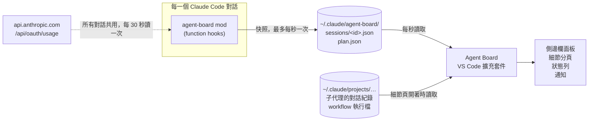

<h1 align="center">Agent Board for Claude Code</h1>

<p align="center">
  <b>在 VS Code 裡，一眼看到每個 Claude Code 子代理正在做什麼。</b><br>
  即時的子代理卡片、完整的任務細節、訂閱用量、上下文用量，涵蓋你開著的所有對話。
</p>

<p align="center">
  
  
  
  
  
</p>

<p align="center"><a href="README.md">English</a> · <b>繁體中文</b></p>

<table>
  <tr>
    <td width="33%" valign="top"></td>
    <td width="33%" valign="top"></td>
    <td width="33%" valign="top"></td>
  </tr>
  <tr>
    <td valign="top"><sub><b>面板。</b>用量、在等你的對話、每一個執行中的子代理。</sub></td>
    <td valign="top"><sub><b>執行中的子代理。</b>這一秒在做什麼、交給它的任務、每一步的輸入和結果。</sub></td>
    <td valign="top"><sub><b>同一個子代理，結束後。</b>它的回報，排版好的。（淺色主題）</sub></td>
  </tr>
</table>

<sub>所有截圖都是虛構的範例資料。</sub>

## 為什麼做這個

Claude Code 可以同時跑好幾個子代理，也可以同時開好幾個對話。在 VS Code 裡，很難看出它們各自在做什麼。

Claude Code 的 mod 可以畫面板和橫條。mod 是用 function hook 寫的外掛，function hook 就是掛在 Claude Code 各種事件上的小函式。但 **VS Code 版的 Claude Code 擴充套件不會把它們畫出來**（查到 2.1.289 版為止）。所以 mod 的面板、輸入框上方的橫條，在 VS Code 裡都看不到，只有終端機版和桌面版看得到。

Agent Board 的做法是把工作拆成兩半：

| 哪一半 | 它是什麼 | 做什麼 |
|---|---|---|
| **mod** | 一個 Claude Code 外掛，每個對話都會載入 | 盯著對話，把狀態寫成小小的 JSON 檔，放在 `~/.claude/agent-board/` |
| **擴充套件** | 一個 VS Code 擴充套件，有自己的側邊欄 | 每秒讀一次那些檔案，把面板畫出來 |

## 你會得到什麼

**即時的子代理面板。** 每個執行中的子代理一張卡片：狀態、類型、步數、現在正在呼叫的工具、已經跑了多久。結束的子代理留一列，附 token 組成。兩分鐘沒有新動作的會標成「暫無動作」，對話不再回報的會標成「可能已中斷」。

**任務細節，像內建的 agent 卡片一樣。** 點任何一張卡片或一列，就打開那個子代理的細節：

- 交給它的完整任務指示
- 時間軸上的每一步工具呼叫：輸入、結果、花了多久、成功（✓）或失敗（✕）
- 它在步驟之間說的話
- 它最後的回報，以 Markdown 排版（表格、清單、程式碼）
- token 用量，每次請求只算一次

按「在編輯區開啟」，同一份細節會用整個編輯區的寬度顯示。workflow 派出的代理會顯示真正的名稱和階段。

<p align="center"></p>

**「需要你」區。** 在等你允許或回答的對話、暫無動作的子代理、剛失敗的子代理，都集中在最上面。有對話在等你時，狀態列會變成「在等你」。

**跟得上的訂閱用量。** 你的 Claude 方案的 5 小時和每週額度；有各模型分項和額外用量的話也會顯示。重置時間的寫法和 claude.ai 的用量頁一樣。狀態列常駐顯示 `5h % · 週 %`。

**對的那個對話的上下文。** 每個對話各自的上下文用量，算法和 `/context` 相同。量表會跟著你正在看的 Claude 分頁，狀態列也有一份。

**通知。** 對話等了 15 秒、子代理完成或失敗、跑很久的一輪做完了、用量跨過 80% 或 90% 時通知你。每一種都有自己的開關。

## 運作方式



- **快照。** mod 掛在對話、回合、工具呼叫、子代理這些事件上。有變化就寫 `sessions/<sessionId>.json`，最多每秒一次，另外每分鐘寫一次當作心跳。檔案裡有子代理清單、對話狀態（工作中、等待、閒置）、上下文用量、額度讀數。
- **用量有兩個來源。** 每次 API 回覆都會附帶額度讀數，很即時，但會稍微落後。`/usage` 讀的那個端點最準，所以由**一個**對話每 30 秒替所有對話讀一次，結果放在 `plan.json`。同一段期間內用量只會增加，所以面板顯示目前這段期間裡**最高**的讀數。期間重置或換帳號後，舊期間的讀數立刻作廢。
- **任務細節。** Claude Code 本來就會把每個子代理的對話紀錄，寫在它所屬對話的紀錄旁邊。細節頁開著時，擴充套件讀那個檔案，檔案變長就再讀一次。它也會讀 workflow 的執行檔，取得代理的名稱和階段。
- **哪個對話算「目前」。** VS Code 不會告訴一個擴充套件，另一個擴充套件的分頁顯示的是哪個對話。所以面板拿分頁上的標題，去比對 Claude Code 寫進每份紀錄裡的標題。

## 需求

- **Claude Code 2.1.289 以上**，而且你的帳號可以使用 mod。這是開發時用的版本。
- **VS Code 1.90 以上**，並已安裝 Claude Code 擴充套件。
- **Claude 訂閱方案**，用量量表才有資料。用 API key 的對話沒有額度資料，其他功能照常。
- **git**，以及 PATH 裡有 `code` 指令。

在 Windows 11 上開發和測試。路徑的處理也考慮了 macOS 和 Linux，但這兩個系統沒有實測過。

## 安裝

### 交給 Claude Code 做

在要安裝的那台電腦上，把這段貼給 Claude Code：

```text
請從 https://github.com/JeremyHo1123/claude-code-agent-board 安裝 Agent Board。
照它 README 的「安裝」一節一步一步做，做完後執行「驗證」裡的每一項檢查，
並告訴我每一項的結果。
```

### 或自己動手

**1. 把這個 repo clone 到 Claude Code 的 mods 資料夾。**

```bash
# macOS、Linux、Git Bash
git clone https://github.com/JeremyHo1123/claude-code-agent-board.git ~/.claude/mods/agent-board
```

```powershell
# Windows PowerShell
git clone https://github.com/JeremyHo1123/claude-code-agent-board.git "$env:USERPROFILE\.claude\mods\agent-board"
```

**2. 讓 Claude Code 載入這個 mod。** 在 `~/.claude/settings.json` 的 `env` 區塊加上 `CLAUDE_CODE_PLUGIN_DIRS`。檔案裡其他的設定都不要動。

```json
{
  "env": {
    "CLAUDE_CODE_PLUGIN_DIRS": "~/.claude/mods/agent-board"
  }
}
```

如果 `CLAUDE_CODE_PLUGIN_DIRS` 原本就有值，把這個資料夾接在後面。路徑之間 Windows 用 `;` 分隔，其他系統用 `:`。

**3. 安裝 VS Code 擴充套件。** `dist/` 裡附了打包好的安裝檔，不用自己編譯。

```bash
# macOS、Linux、Git Bash
code --install-extension ~/.claude/mods/agent-board/dist/agent-board.vsix --force
```

```powershell
# Windows PowerShell
code --install-extension "$env:USERPROFILE\.claude\mods\agent-board\dist\agent-board.vsix" --force
```

**4. 重新載入。** 在 VS Code 的命令選擇區執行 **Developer: Reload Window**。這會重開那個視窗裡的 Claude Code 對話，所以請挑沒有對話正在工作的時候做。每個對話啟動時就會載入 mod。

### 驗證

| 檢查 | 應該看到 |
|---|---|
| `claude plugin validate ~/.claude/mods/agent-board` | 最後一行是 `Validation passed` |
| 在 Claude Code 對話裡輸入 `/agent-board` | 回覆子代理面板 |
| 列出 `~/.claude/agent-board/sessions/` | 每個開著的對話各有一個 `<sessionId>.json`，修改時間在一分鐘內 |
| `code --list-extensions --show-versions` | 列出 `jeremy-local.agent-board@0.5.1` |
| 看 VS Code | 活動列有 **Agent Board** 圖示；對話回覆過一次後，狀態列出現 `5h …% · 週 …%` 和 `上下文 …%` |

### 更新

```bash
git -C ~/.claude/mods/agent-board pull
code --install-extension ~/.claude/mods/agent-board/dist/agent-board.vsix --force
```

然後重新載入視窗。如果只改了 mod，不必重新載入視窗：互動式的對話會監看這個資料夾，自己重新載入 mod；輸入 `/reload-plugins` 可以強制重新載入。

### 移除

```bash
code --uninstall-extension jeremy-local.agent-board
```

把這個資料夾從 `CLAUDE_CODE_PLUGIN_DIRS` 拿掉，再刪除 `~/.claude/mods/agent-board` 和 `~/.claude/agent-board`。

## 設定

都在 VS Code 設定的 `agentBoard.*` 底下。

| 設定 | 預設 | 作用 |
|---|---|---|
| `agentBoard.autoReveal` | `true` | 同時有 2 個以上子代理在跑時，自動顯示面板（不會搶走鍵盤焦點） |
| `agentBoard.usageInStatusBar` | `true` | 狀態列常駐顯示 `5h % · 週 %`；70% 起變黃，90% 起變紅 |
| `agentBoard.contextInStatusBar` | `true` | 狀態列常駐顯示目前對話的上下文用量 |
| `agentBoard.notify.waiting` | `true` | 對話等你回答或允許超過 15 秒時通知 |
| `agentBoard.notify.subagents` | `true` | 子代理完成或失敗時通知；一次 3 個以上合併成一則 |
| `agentBoard.notify.turnDone` | `true` | 跑超過 2 分鐘的一輪做完時通知 |
| `agentBoard.notify.usage` | `true` | 5 小時或每週額度跨過 80% 或 90% 時通知 |
| `agentBoard.dataDirectory` | `""` | 快照所在的資料夾；留空表示 `~/.claude/agent-board/sessions` |

在終端機版的對話裡，輸入 `/agent-board` 也會打開一個面板，顯示該對話的子代理。

## 它讀什麼、送出什麼

- **只在你的電腦上讀取：** mod 自己寫的快照，以及 Claude Code 存在 `~/.claude/projects/` 的對話紀錄（用來取得對話標題和子代理細節）。它不會寫入那個資料夾。
- **只發出一種網路請求：** `GET https://api.anthropic.com/api/oauth/usage`，就是 Claude Code 的 `/usage` 讀的端點。請求透過 Claude Code 的憑證代號（`$.session.authorize()`）送出，所以 token 不會經過 mod 的程式碼。所有對話加起來最多每 30 秒一次；被拒絕時會拉長間隔，最長 10 分鐘。
- **沒有任何遙測。** 除此之外，沒有資料離開你的電腦。

`claude plugin validate` 會印出 mod 掛了哪些事件、呼叫了什麼、讀了什麼，你可以自己核對。

## 限制

- **VS Code 裡做不到輸入框上方的橫條。** 那裡的 Claude 面板不接受 mod 的介面，所以上下文用量改放在狀態列。
- **workflow 代理的真名，要等 workflow 跑完才有。** Claude Code 到那時才寫出執行檔。在那之前，每個代理先用它任務指示的第一行當名字。
- **看不到思考內容。** 紀錄檔裡的思考區塊只存了簽章，所以細節頁只顯示思考花了多久。
- **「等你允許」可能多停留一下：** 你允許的工具如果執行很久，這段期間仍會顯示等待。
- **對話是靠標題比對的。** 兩個標題相同的對話分不出來；剛開、還沒有標題的對話，只有在它是唯一一個時才對得上。
- **用量端點不是公開 API。** 它的格式可能改變。改變時，面板會退回只用 API 回覆附帶的讀數。
- **側邊欄會截短長內容**（每步結果 1,500 字、回報 20,000 字），編輯區分頁能顯示的多很多。超過 8 MB 的紀錄檔只讀一部分。
- **介面只有繁體中文。** 字串在 `hooks/format.ts`、`hooks/register.tsx`、`vscode-extension/extension.js`、`vscode-extension/media/*.js`。

## 疑難排解

| 看到什麼 | 代表什麼 | 怎麼辦 |
|---|---|---|
| 面板顯示「還沒收到資料」 | 還沒有快照：mod 沒有載入 | 檢查 `CLAUDE_CODE_PLUGIN_DIRS`、重新載入視窗、輸入 `/agent-board` |
| `/agent-board` 是未知指令 | 這個對話無法使用 mod | 更新 Claude Code；對資料夾執行 `claude plugin validate`，看它怎麼說 |
| ⚠ 用量查詢被限流 | 用量端點拒絕了（HTTP 429） | 不用處理：它會自己重試，而且回覆附帶的讀數會讓 5 小時和每週的數字繼續更新 |
| 上下文量表顯示的是別的對話 | 還沒對上任何 Claude 分頁 | 點一下你要看的那個 Claude 分頁 |
| 細節頁說找不到紀錄檔 | 子代理的紀錄要等它第一次回覆後才出現 | 等一下；舊對話的檔案若已清除，就找不回來 |
| 子代理叫做「未具名代理」 | workflow 的代理，紀錄檔還沒寫出來 | 一兩秒內會換成它任務指示的第一行 |

## 開發

```text
agent-board/                  這個 repo，同時也是 mod 的資料夾
├─ .claude-plugin/plugin.json mod 的資訊檔
├─ .claude/CLAUDE.md          給維護者（和 agent）看的專案筆記
├─ hooks/                     mod 本體：register.tsx（hooks）、format.ts（純函式）
├─ types/                     mod 的 $.state 型別約定
├─ tests/                     mod 的測試
├─ vscode-extension/          擴充套件
│  ├─ extension.js            輪詢、合併用量、讀紀錄檔、狀態列、通知
│  ├─ media/                  畫面：board.js、detail.js、panel.js、board.css
│  ├─ test/                   擴充套件測試，另有兩個拿真實資料做的唯讀檢查
│  └─ preview/                用瀏覽器直接看畫面，資料是虛構的
├─ dist/agent-board.vsix      打包好的擴充套件
└─ docs/images/               上面的截圖
```

**mod。** mod 第一次載入時，Claude Code 會把它的 API 型別放進 `.claude-plugin/types/`；`tsc` 需要這些檔案。

```bash
claude plugin validate .                    # 引擎會接受或拒絕什麼
claude plugin test .                        # 跑 tests/ 底下的測試
npx -y -p typescript@5.8 tsc -p . --noEmit  # 型別檢查（型別檔出現之後才能跑）
```

**擴充套件。** 純 JavaScript，沒有任何相依套件。

```bash
cd vscode-extension
node test/extension.test.js        # 邏輯測試，用假的 vscode 模組
node test/real-transcripts.js 30   # 解析你最近 30 份子代理紀錄（唯讀）
node test/live-smoke.js            # 用你真實的快照跑一次輪詢（唯讀）
```

用瀏覽器打開 `vscode-extension/preview/index.html`，不用 VS Code 也能看面板；檔案開頭列出了可用的網址參數。`preview/shoot.sh` 用無頭 Chrome 截圖。

**打包。**

```bash
cd vscode-extension
npx -y @vscode/vsce@latest package --no-dependencies --skip-license -o ../dist/agent-board.vsix
code --install-extension ../dist/agent-board.vsix --force
```

[.claude/CLAUDE.md](.claude/CLAUDE.md) 記錄了 agent 維護這個專案需要知道的事：資料格式、程式碼遵守的規則、踩過的坑。

## 致謝

- 對話狀態和通知的設計，參考了 Learning Hacker 的 [dispatch-board](https://github.com/Hangghost/learning-hacker-claude-mod)。
- 用 [Claude Code](https://claude.com/claude-code) 做出來的。

## 授權

[MIT](LICENSE)
